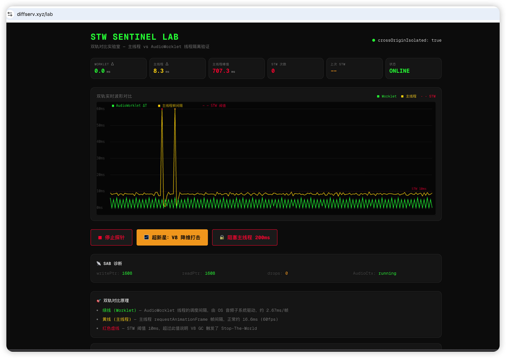

# stw-sentinel 🛡️

[](https://www.npmjs.com/package/stw-sentinel)
[](https://opensource.org/licenses/MIT)

> **基于 AudioWorklet + SharedArrayBuffer 的 V8 Stop-The-World 哨兵，零拷贝、无锁、亚毫秒级精度。**
>
> High-precision, lock-free Stop-The-World (STW) sentinel for Web Audio using SharedArrayBuffer.

---



---

## 🇨🇳 中文文档

### 这是什么？

当 V8 引擎执行 Major GC 时，主线程会完全冻结（Stop-The-World）。最悖论的是：**你写在主线程里的监控代码（rAF、performance.now）也一起冻住了——你没法在心脏停跳的时候按秒表。**

`stw-sentinel` 的思路是：把监控逻辑放到 **AudioWorklet** 里。它跑在操作系统的实时音频线程上，优先级比渲染线程还高。主线程卡死 700ms，音频心跳依然稳在 2.67ms。

两边通过 `SharedArrayBuffer` + `Atomics` 共享内存，零拷贝、无锁、纯原子操作。

### 🔬 在线实验室

👉 **[打开 Isolation Lab](https://diffserv.xyz/lab)**

点击「超新星核爆」按钮，亲手触发 V8 Major GC。你会看到：
- **红线**（主线程）卡成直线
- **绿线**（stw-sentinel 心跳）纹丝不动

### 📦 安装

```bash
npm install stw-sentinel
```

一行命令试毒：
```bash
npx stw-sentinel
```

### 🚀 服务端配置（必读）

`SharedArrayBuffer` 在现代浏览器中默认被禁用（Spectre 防御）。你 **必须** 配置 Cross-Origin Isolation 响应头：

```nginx
# Nginx 配置
add_header Cross-Origin-Opener-Policy "same-origin" always;
add_header Cross-Origin-Embedder-Policy "require-corp" always;
```

没这两个头，SAB 连边都摸不到。

### 💻 使用

```typescript
import { STWSentinel } from 'stw-sentinel';

const sentinel = new STWSentinel({
  bufferSize: 4096,       // SharedArrayBuffer 容量
  thresholdMs: 10,        // 超过 10ms 判定为 STW 尖峰
  processorUrl: '/processor.js'  // processor 文件路径
});

await sentinel.init();
sentinel.start();

// 在主线程轮询数据
function poll() {
  const entries = sentinel.drain();
  for (const { time, deltaMs } of entries) {
    if (deltaMs > 10) {
      console.warn(`🔥 STW 尖峰: ${deltaMs}ms`);
    }
  }
  requestAnimationFrame(poll);
}
poll();
```

### 🧠 内存布局

```
+---------------------------------------------------------------+
|                      SharedArrayBuffer (SAB)                  |
+---------------------------------------------------------------+
| HEADER (16 字节 = 4 个 Int32 元素)                             |
| [0] writePtr  : Worklet 写入位置                               |
| [1] readPtr   : 主线程读取位置                                  |
| [2] dropCount : 溢出计数（主线程卡太久时）                       |
| [3] reserved  : 对齐预留                                       |
+---------------------------------------------------------------+
| DATA 区域 (16384 字节 = 4096 个 Int32 元素)                    |
| [ Timestamp(ns), Delta(ns) ] × 2048 组                        |
+---------------------------------------------------------------+
```

**踩坑提示**：`Int32Array` 的索引按 4 字节步进，16 字节 Header 对应索引 4（16 ÷ 4 = 4），不是 16。这个寻址转换坑了我半个通宵。

---

## 🇺🇸 English Documentation

### What is this?

When V8 Garbage Collection (Major GC) hits, the main thread freezes. Traditional timers (`requestAnimationFrame`, `setTimeout`) are completely paralyzed — **you can't time your own heartbeat while your heart has stopped.**

`stw-sentinel` places the monitor inside **AudioWorklet**, which runs on a separate, high-priority OS thread. Even when the main thread freezes for 700ms, the audio heartbeat stays rock-solid at 2.67ms.

Communication is via `SharedArrayBuffer` + `Atomics`: zero-copy, lock-free, pure atomic operations.

### 🔬 Live Lab & Interactive Demo

👉 **[Enter the DiffServ Isolation Lab](https://diffserv.xyz/lab)**

Click the **"Supernova Bomb"** to intentionally trigger V8 Major GC. You'll see the main thread UI completely freeze (700ms+ spikes) while the `stw-sentinel` audio probe maintains a perfectly flat 2.67ms heart rate.

### 📦 Installation

```bash
npm install stw-sentinel
```

Quick test:
```bash
npx stw-sentinel
```

### 🚀 Server Configuration (Required)

`SharedArrayBuffer` is disabled in modern browsers by default to prevent Spectre attacks. You **MUST** serve your application with Cross-Origin Isolation headers:

```nginx
# Nginx configuration
add_header Cross-Origin-Opener-Policy "same-origin" always;
add_header Cross-Origin-Embedder-Policy "require-corp" always;
```

### 💻 Usage

```typescript
import { STWSentinel } from 'stw-sentinel';

const sentinel = new STWSentinel({
  bufferSize: 4096, // Capacity of the SharedArrayBuffer
  thresholdMs: 10,  // Trigger STW alert if delta exceeds 10ms
  processorUrl: '/processor.js' // Path to your served processor file
});

await sentinel.init();
sentinel.start();

// Drain data in main thread
function poll() {
  const entries = sentinel.drain();
  for (const { time, deltaMs } of entries) {
    if (deltaMs > 10) {
      console.warn(`🔥 STW Spike Detected: ${deltaMs}ms`);
    }
  }
  requestAnimationFrame(poll);
}
poll();
```

### 🧠 Architecture: Memory Layout

```text
+---------------------------------------------------------------+
|                      SharedArrayBuffer (SAB)                  |
|                      Total Size: 16400 Bytes                  |
+---------------------------------------------------------------+
| HEADER (16 Bytes / 4 Int32 Elements)                          |
| [0] writePtr : Updated by Worklet                             |
| [1] readPtr  : Updated by Main Thread (drain)                 |
| [2] dropCount: Tracks overflow if Main Thread hangs too long  |
| [3] reserved : For future alignment                           |
+---------------------------------------------------------------+
| DATA CAP (16384 Bytes / 4096 Int32 Elements)                  |
| Contains 2048 Pairs of Data:                                  |
| [ Timestamp (ns) , Delta (ns) ]                               |
+---------------------------------------------------------------+
```

**Pitfall**: `Int32Array` indexes step by 4 bytes. A 16-byte Header maps to index **4** (16 ÷ 4 = 4), not 16. This offset bug cost me a sleepless night.

## ⚖️ License

MIT License © 2026 DiffServ Lab
